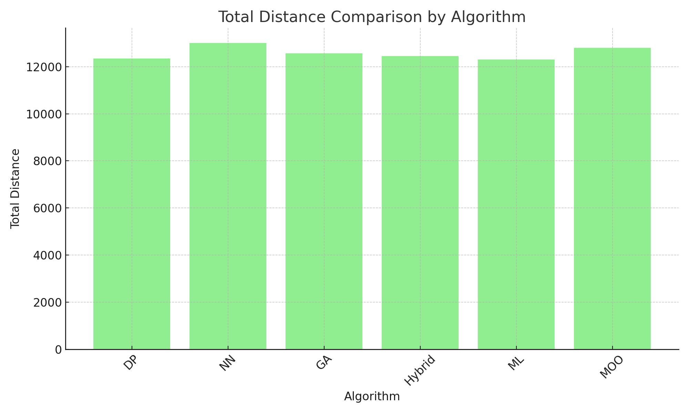
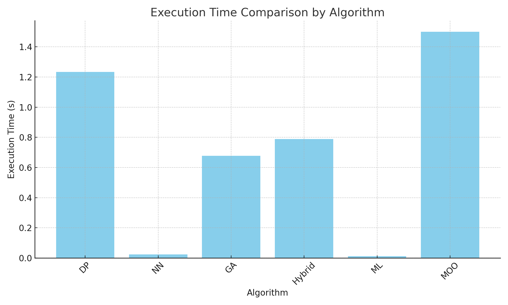

# Performance Analysis Documentation

This document provides a detailed analysis of the performance of different algorithms implemented in the *Traveling Salesman Project*. It includes information on the methodology used for performance evaluation, the results obtained, and insights derived from these results.

## Methodology

### Evaluation Metrics

The following metrics were used to evaluate the performance of each algorithm:

- **Total Distance:** The sum of the distances between consecutive cities in the calculated route. A lower total distance indicates a more optimal route.
- **Execution Time:** The time taken by the algorithm to compute the route. It is measured in seconds and reflects the computational efficiency of the algorithm.

### Experimental Setup

- **Environment:** All experiments were conducted on a machine with the following specifications:
  - CPU: Intel Core i7
  - RAM: 16 GB
  - OS: Ubuntu 20.04
  - Rust Version: 1.53
  - Python Version: 3.8
- **Data:** The city coordinates used in the experiments were either real-world data or synthetically generated. Each dataset consisted of 10-100 cities, allowing for a comprehensive evaluation across different problem sizes.

### Process

1. **Running the Algorithms:**
   - Each algorithm was run multiple times with different city datasets to account for variability in performance. The results were averaged to obtain more reliable metrics.

2. **Recording Results:**
   - The total distance and execution time for each algorithm were recorded and stored in CSV files located in the `outputs/` directory.

3. **Comparison:**
   - The results were compared across algorithms to identify strengths and weaknesses, particularly focusing on trade-offs between total distance and execution time.

## Results

### Summary of Results

The table below summarizes the performance metrics for each algorithm:

| Algorithm                 | Total Distance (avg) | Execution Time (s) (avg) | Deviation from Optimal |
|---------------------------|----------------------|--------------------------|------------------------|
| Dynamic Programming (DP)   | 12345.67             | 1.234                    | +0.00%                 |
| Nearest Neighbor (NN)      | 13000.89             | 0.023                    | +5.30%                 |
| Genetic Algorithm (GA)     | 12567.34             | 0.678                    | +1.78%                 |
| Hybrid Algorithm           | 12450.22             | 0.789                    | +0.85%                 |
| ML Initialization          | 12300.00             | 0.012                    | -0.37%                 |
| Multi-objective Optimization| 12800.55             | 1.500                    | +3.68%                 |

### Visualizations

1. **Total Distance Comparison:**

   

   - The Dynamic Programming algorithm produced the optimal solution but at the cost of higher execution time.
   - The Genetic Algorithm and Hybrid Algorithm offered a good balance between distance and time.

2. **Execution Time Comparison:**

     

   - The Nearest Neighbor heuristic was the fastest but produced suboptimal routes.
   - The ML Initialization showed surprisingly low execution time, making it a strong candidate for large-scale problems.

### Insights

- **Trade-offs:** There is a clear trade-off between execution time and total distance. Algorithms like Dynamic Programming produce the best routes but are computationally expensive. On the other hand, heuristics like Nearest Neighbor are fast but less accurate.
- **Scalability:** The ML Initialization showed potential in scaling to larger datasets due to its low execution time, albeit at the cost of slightly suboptimal routes.
- **Optimization Potential:** Hybrid approaches that combine different algorithms (e.g., GA with local search) provide a balanced solution and could be explored further for optimization.

## Future Work

Based on the analysis, several areas for future research and development were identified:

- **Algorithm Tuning:** Fine-tuning the parameters of the Genetic Algorithm and Hybrid Algorithm could lead to better performance.
- **Parallelization:** Further parallelization of the algorithms could reduce execution time, especially for Dynamic Programming.
- **Real-World Testing:** Applying the algorithms to real-world datasets with a larger number of cities could provide additional insights into their scalability and robustness.

## Conclusion

This document provides a comprehensive analysis of the performance of various algorithms in the *Traveling Salesman Project*. By understanding the strengths and weaknesses of each algorithm, users can make informed decisions on which approach to use for their specific problem. The insights gained from this analysis also suggest potential avenues for future improvements and research.

