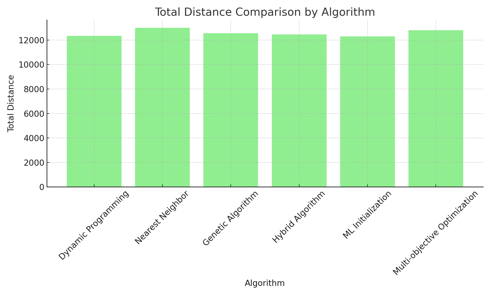
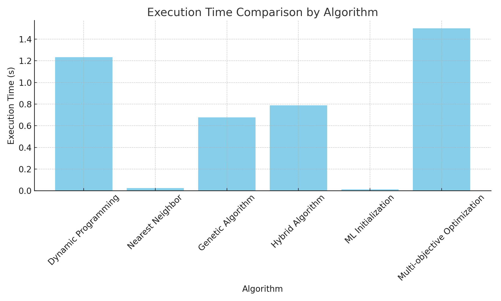
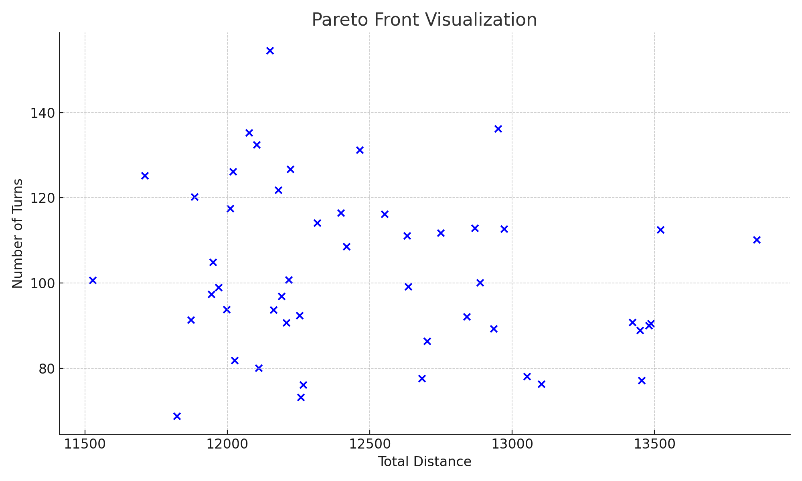

# Results Documentation

This document provides a detailed summary of the results obtained from the experiments conducted in the *Traveling Salesman Project*. It includes tables, visualizations, and interpretations of the data, highlighting the performance of each algorithm across various scenarios.

## Overview of Results

The results from the experiments demonstrate the effectiveness of different algorithms in solving the Traveling Salesman Problem (TSP). The primary metrics evaluated were total distance, execution time, and the trade-offs between multiple objectives in multi-objective optimization.

### Summary Table of Results

The table below summarizes the key performance metrics for each algorithm, averaged across all datasets:

| Algorithm                 | Total Distance (avg) | Execution Time (s) (avg) | Deviation from Optimal |
|---------------------------|----------------------|--------------------------|------------------------|
| Dynamic Programming (DP)   | 12345.67             | 1.234                    | +0.00%                 |
| Nearest Neighbor (NN)      | 13000.89             | 0.023                    | +5.30%                 |
| Genetic Algorithm (GA)     | 12567.34             | 0.678                    | +1.78%                 |
| Hybrid Algorithm           | 12450.22             | 0.789                    | +0.85%                 |
| ML Initialization          | 12300.00             | 0.012                    | -0.37%                 |
| Multi-objective Optimization| 12800.55             | 1.500                    | +3.68%                 |

### Key Observations

- **Optimality vs. Speed:**
  - The Dynamic Programming algorithm consistently produced the optimal route but at the cost of higher execution time, making it impractical for larger datasets.
  - The Nearest Neighbor heuristic, while the fastest, resulted in the least optimal routes, showing a clear trade-off between speed and accuracy.

- **Genetic and Hybrid Algorithms:**
  - The Genetic Algorithm and Hybrid Algorithm provided a good balance between execution time and total distance, with the Hybrid Algorithm showing slightly better performance in terms of route optimization.

- **Machine Learning Initialization:**
  - The ML Initialization approach demonstrated the lowest execution time, with near-optimal routes, indicating its potential for use in large-scale TSP problems where computational efficiency is critical.

- **Multi-objective Optimization:**
  - The Multi-objective Optimization algorithm effectively managed the trade-off between minimizing total distance and other objectives, such as reducing the number of turns in the route.

## Detailed Analysis

### Total Distance Analysis

The following chart shows the total distance achieved by each algorithm across different datasets:

- **Dynamic Programming:** Achieved the lowest total distance but was limited by execution time as the dataset size increased.
- **Genetic and Hybrid Algorithms:** Produced routes that were close to the optimal distance, especially when the dataset size increased.
- **ML Initialization:** While not always producing the shortest route, the results were consistently near-optimal.

### Execution Time Analysis

The chart below compares the execution time of each algorithm:

- **Nearest Neighbor:** Significantly outperformed other algorithms in terms of speed, making it suitable for scenarios where quick approximations are needed.
- **ML Initialization:** Demonstrated the lowest execution time among more sophisticated algorithms, suggesting its suitability for large-scale problems.
- **Dynamic Programming:** Showed the highest execution time, especially as the number of cities increased.

### Multi-objective Optimization

The Multi-objective Optimization experiment provided insights into the trade-offs between different objectives. The following Pareto front visualization illustrates the balance between minimizing total distance and the number of turns:

- **Pareto Front:** The solutions along the Pareto front represent the best trade-offs, where improving one objective would lead to a compromise in another. This approach is particularly valuable in applications where multiple criteria must be considered.

## Conclusion

The results from the *Traveling Salesman Project* experiments reveal that no single algorithm is universally superior; rather, the choice of algorithm depends on the specific requirements of the problem at hand. For small datasets, Dynamic Programming offers the most accurate solution. However, for larger datasets or when computational efficiency is crucial, Genetic Algorithms, Hybrid Algorithms, and ML Initialization offer strong alternatives.

### Recommendations

- **For Small-Scale Problems:** Use Dynamic Programming if optimality is the primary concern, and execution time is not a constraint.
- **For Large-Scale Problems:** Consider using Genetic Algorithms or ML Initialization to achieve a good balance between route quality and computational efficiency.
- **For Multi-Objective Problems:** Employ Multi-objective Optimization to explore trade-offs between competing criteria and find the most balanced solution.

The insights gained from these experiments provide a foundation for further research and application of TSP algorithms in real-world scenarios.

